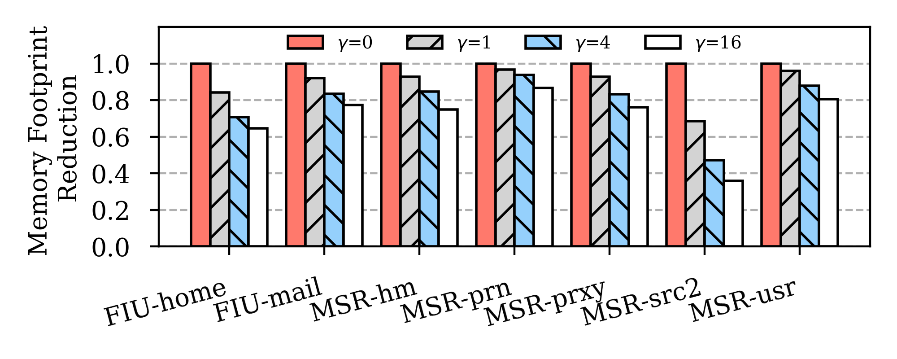

# LeaFTL 

LeaFTL is a learning-based flash translation layer (FTL), which learns the address mapping and tolerates dynamic data access patterns via linear regression at runtime to reduce the memory footprint of the address mapping.

## 1. System Setup

The following packages and benchmarks are necessary to install before running the experiments. It is recommended to allocate a dedicated server for these experiments as they are both cpu and memory intensive.

```shell
git clone https://github.com/my-HenryS/LeaFTL.git
cd LeaFTL
pushd .
# Download traces
cd wiscsee/leaftl_scripts
pip3 install gdown
gdown 13gS89MNWESywUA3ZGycSwYTFjZ29qdGu
unzip leaftl_traces.zip
popd

# Set Env Variables
export PYTHONPATH=$PYTHONPATH:$(pwd)/wiscsee

# Install Pypy to speedup the experiment running
# You can run WiscSim 2-3× faster with Pypy. You can install Pypy2 with this guide: https://doc.pypy.org/en/latest/install.html.
wget https://downloads.python.org/pypy/pypy2.7-v7.3.9-linux64.tar.bz2
tar xf pypy2.7-v7.3.9-linux64.tar.bz2
export PATH=$PATH:$(pwd)/pypy2.7-v7.3.9-linux64/bin
pypy -m ensurepip

# Install dependencies
sudo apt-get install libblas-dev liblapack-dev libatlas-base-dev gfortran

# Install Python packages
cd wiscsee/leaftl_scripts
./setup.sh
```


## 2. Simulation-based Experiments

### 2.0 Directory Structures

```shell
leaftl_scripts/
├── batch  # script to run a batch of experiments
├── leaftl_traces  # leaftl traces
├── plot_all   # script to plot figures
├── plots     # directory for figures
├── raw_results     # raw experiment output
├── reference_plots   # reference figures
├── run_ftl      # simulator entry function
├── setup.sh    # env setup script
└── warmup    # warmup workloads
```

### 2.1 Memory Reduction Comparison with Baseline FTLs

```shell
cd LeaFTL/wiscsee/leaftl_scripts
# Run batch of experiments (replace $PARALLELISM with an integer, e.g. 10; higher parallelism will consume memory but run the experiments faster)
./batch memory_batch $PARALLELISM
# Run plot scripts
./plot_all memory_batch
```

#### 2.1.1 Expected Results

### 2.2 Performance Improvement Comparison with Baseline FTLs

```shell
cd LeaFTL/wiscsee/leaftl_scripts
# Run warmup workloads (replace $PARALLELISM with an integer in [1, 5], higher parallelism will consume memory but run the experiments faster)
pypy warmup $PARALLELISM
# Run batch of experiments (replace $PARALLELISM with an integer, e.g. 10)
./batch main_batch $PARALLELISM
# Run plot scripts
./plot_all main_batch
```

#### 2.2.1 Expected Results


### 2.3 Sensitivity Analsysis with Different Gamma

```shell
cd LeaFTL/wiscsee/leaftl_scripts
# Run batch of experiments (replace $PARALLELISM with an integer, e.g. 10)
./batch sensitivity_batch $PARALLELISM
# Run plot scripts
./plot_all sensitivity_batch
```

#### 2.3.1 Expected Results





